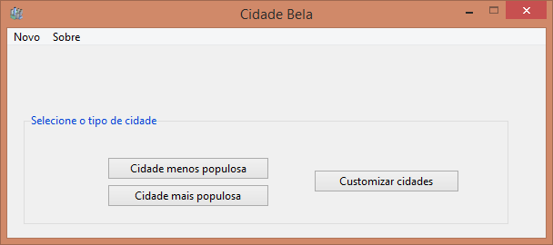
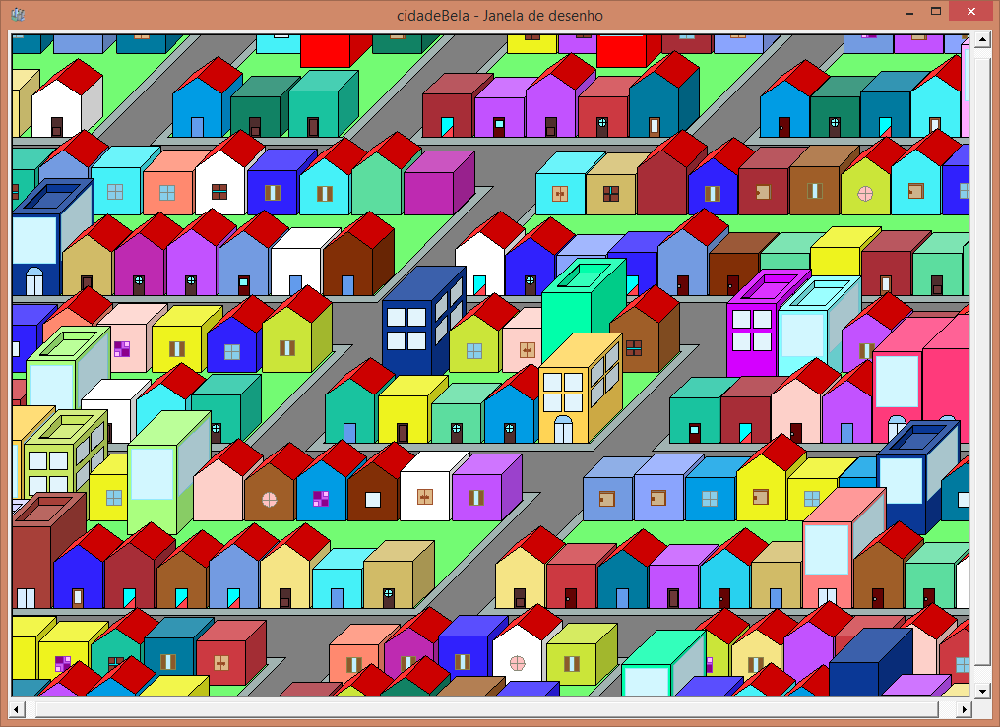
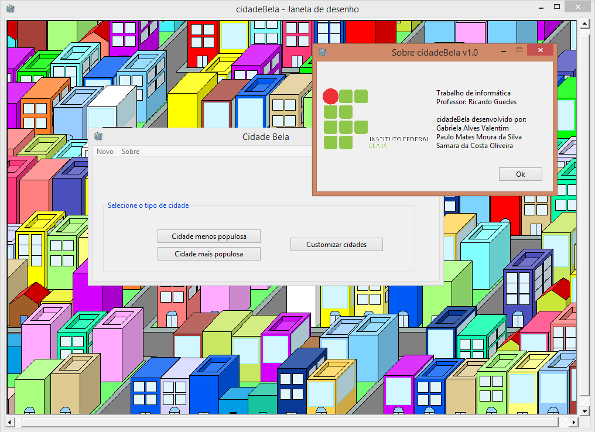

# CidadeBela

* **Developer Manual**: Trabalho de Python.pdf
* **Installer**: cidadeBela.exe
* **Executable**: cidadeBela/
- _Run_ cidadeBela/cidadeBela/janelaGrafica.exe
- _Run - Dev_ cidadeBela/cidadeBela/janelaGrafica - Desenvolvedor.exe
* **Python Files**: cidadeBela.py/
 - _Easy run_ cidadeBela.py/janelaGrafica.py
 - _Easy run - Dev_ cidadeBela.py/janelaGrafica - Desenvolvedor.py
* **Tools**: Programa/

